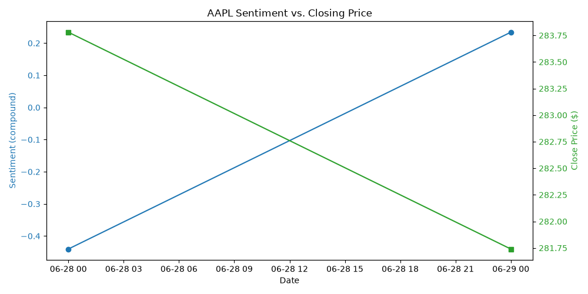

# Stock Sentiment Analyzer

This is a small project I built to see if news sentiment about a stock actually lines up with how the stock price moves. It pulls recent headlines about a company, scores how positive/negative they are, and compares that to the stock's closing price.

## How it works
- Pulls recent headlines about a company using the NewsAPI
- Runs each headline through VADER (a sentiment analysis tool) to get a score from -1 (very negative) to +1 (very positive)
- Averages the sentiment scores by day
- Pulls the stock's price history using yfinance
- Lines up the sentiment and price data by date
- Plots both on a chart so you can visually compare them

## Example output

## Things I ran into / learned
- My first attempt at merging the sentiment and price data kept giving me an empty result. Turned out some of my headline dates were on weekends, when the stock market is closed, so there was no price data to match. I fixed this using `pd.merge_asof`, which matches each headline to the closest previous trading day instead of requiring an exact date match.
- VADER isn't built for finance specifically, so it sometimes misses things. For example, a headline saying a bank "stays bullish" on the stock scored as neutral, even though "bullish" is a clearly positive word in investing. A more accurate version of this would probably need a finance-specific sentiment model.
- In the small sample I tested, sentiment and price actually moved in opposite directions, which I wasn't expecting. I don't think this is enough data to say sentiment doesn't matter — just that short-term correlation isn't obvious or guaranteed.

## Built with
Python, requests, pandas, vaderSentiment, yfinance, matplotlib

## How to run it
1. Clone this repo
2. `pip install -r requirements.txt`
3. Make a `.env` file with `NEWS_API_KEY=your_key_here`
4. Run `python fetch_headlines.py`

## What I'd add next
- Test it on more than one company/ticker
- Try a sentiment model made for finance instead of VADER
- Look at sentiment vs. price over a longer time period to see if there's a real pattern